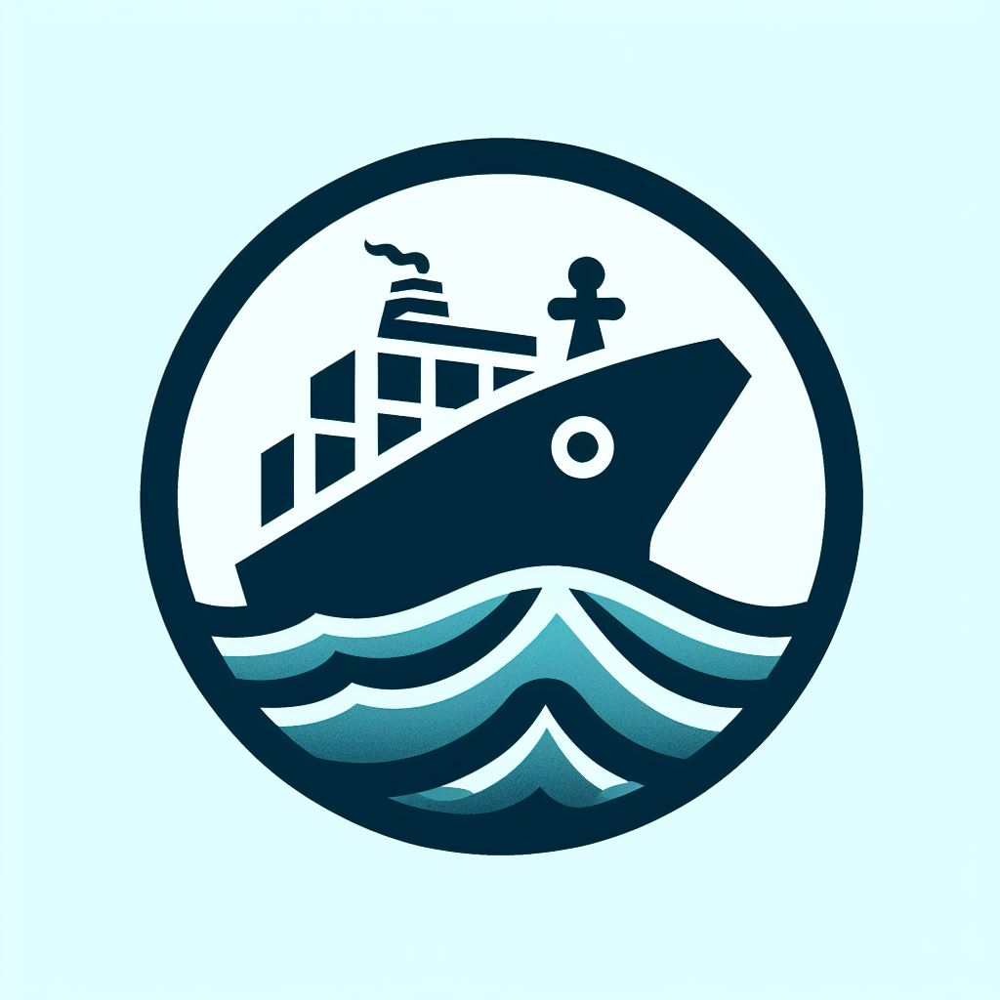

    

    
# Vessel Keeper Application
  Welcome to the Marine Vessel Keeper application! This document provides guidance on how to use the various features 
  and functionalities offered by the application.

## Table of Contents

1. [Introduction](#introduction)
2. [Technologies used](#technologies_used)
3. [Getting Started](#getting-started)
4. [Authentication Service](#authentication-service)
5. [Gateway Service](#gate-service)
6. [Vessel Service](#vessel-service)
7. [Voyage Service](#voyage-service)
8. [Crew Service](#crew-service)
9. [VessekFinder Service](#vesselfinder-service)
10. [Third Party API Documentation](#api-doc)

## Introduction 

The Marine Vessel Keeper application is designed to manage information about vessels, voyages, seamen,
and users. It provides features for creating, updating, and deleting records related to these entities.

## Technologies used 

- Language - Java 17
- Framework - Spring Boot 3
- Database - PostgreSQL
- Working with DB - Hibernate, JPA, Spring Data
- Data migration - Liquibase
- Security - Spring Security
- Authentication - Basic auth. / JWT token
- Password Encoder - BCryptPasswordEncoder
- Scheduling - Cron
- Code documentation - JavaDoc, Swagger
- Mapping - MapStruct
- Exception handling - Controller advice
- Testing - Junit, Mockito, Data JPA test, WebMVC test
- Build System - Maven
- Containerization - Docker/DockerHub, Docker compose
- Third party API connection - Spring Cloud Feign
- Message brocker - RabbitMQ
- Routing - Spring Cloud Gateway 
- Deploy - AWS Elastic Server
- Version control - Git/GitHub

## Getting Started 

To begin using the Marine Vessel Keeper application, follow these steps:

1. Install Docker (If necessary).
2. Clone the repository from [https://github.com/wtypmah24/Vessel_keeper_microservices.git].
3. Add an application-secrets.properties file with the following keys and their respective values:
4. "secret_key" for the Vessel API, "vessel_finder_api_key" for the Vessel Finder API,
5. and "google_api" for the Google Static Map API.
4. Navigate to the project directory.
5. Run docker-compose up command.
6. To check all end points visit [/swagger-ui.html]

If you want to run it on a server:

1. Clone the repository from [https://github.com/wtypmah24/Vessel_keeper_microservices.git].
2. Add an application-secrets.properties file with the following keys and their respective values:
3. "secret_key" for the Vessel API, "vessel_finder_api_key" for the Vessel Finder API, and "google_api"
4. for the Google Static Map API.
3. Run the [bash script](https://github.com/wtypmah24/Vessel_keeper/blob/main/install_dependencies.sh) which will
   download necessary programs such as Git, Java, Maven, Docker, Docker Compose onto the server.
4. Navigate to the project directory.
5. Run docker-compose up command.
6. To check all end points visit [/swagger-ui.html]

## Authentication Service 

The Authentication Service enables users Registration/Authentication/Authorization

- [TokenService](#):
  Provides methods for generating JWT tokens.
- [TokenValidationService](#):
  Provides methods for validating JWT tokens.

## Gateway Service  
The Gateway Service configures the routes for all services
and defines route rules using RouteLocatorBuilder and applies token validation 
filters to secure certain routes.

- [TokenCheckService](#):
  The TokenCheckService class is responsible for sending token verification requests 
  to the authentication service via RabbitMQ.
  It utilizes a RabbitTemplate to send and receive messages.

- [TokenValidationToken](#):
  The TokenValidationFilter class is a GatewayFilter used for token validation and access control in the gateway service.
  It extracts the token from the request, sends it to the TokenCheckService for validation, and checks access based on the user's role.

## Vessel Service 

The Vessel Service enables users to manage vessel-related information.

- [VesselService](#):
  Manages vessel creation, deletion, and retrieval.
- [VesselRepository](#):
  Provides data access methods for vessel entities.
- [VesselMapper](#):
  Handles mapping between vessel DTOs and entities.

## Voyage Service 

The Voyage Service facilitates the management of voyage details such as ports of loading and discharging,
start and end dates, and vessel assignments.

- [VoyageService](#):
  Manages voyage creation, deletion, and retrieval.
- [VoyageRepository](#):
  Provides data access methods for voyage entities.
- [VoyageMapper](#):
  Handles mapping between voyage DTOs and entities.

## Crew Service 

The Crew Service allows users to manage seaman-related information, including certificates
and service records.

- [SeamanService](#):
  Manages seaman creation, deletion, and retrieval.
- [SeamanRepository](#):
  Provides data access methods for seaman entities.
- [SeamanMapper](#):
  Handles mapping between seaman DTOs and entities.
- [RecordOfServiceService](#):
  Manages seamen's record of services.
- [RecordOfServiceRepository](#):
  Provides data access methods for record of services.
- [RecordOfServiceMapper](#):
  Handles mapping between record of services dto and entity.
- [CertificateService](#):
  Manages seamen's certificate adding and deleting.
- [CertificateRepository](#):
  Provides data access methods for seamen's certificates entities.
- [CertificateMapper](#):
  Handles mapping between certificate dtos and entities. 

  ## VesselFinder Service 
- [VesselFinderService](#):
Provides functionality to retrieve real-time vessel information from a remote service (VesselFinder)
- [PositionSevice](#): 
Provides functionality to generate a static Google Maps URL
with markers for the positions of vessels.

## Third Party API Documentation 
- [Vessel Finder](https://api.vesselfinder.com/docs/)
- [Google](https://developers.google.com/maps/documentation/maps-static/start)
